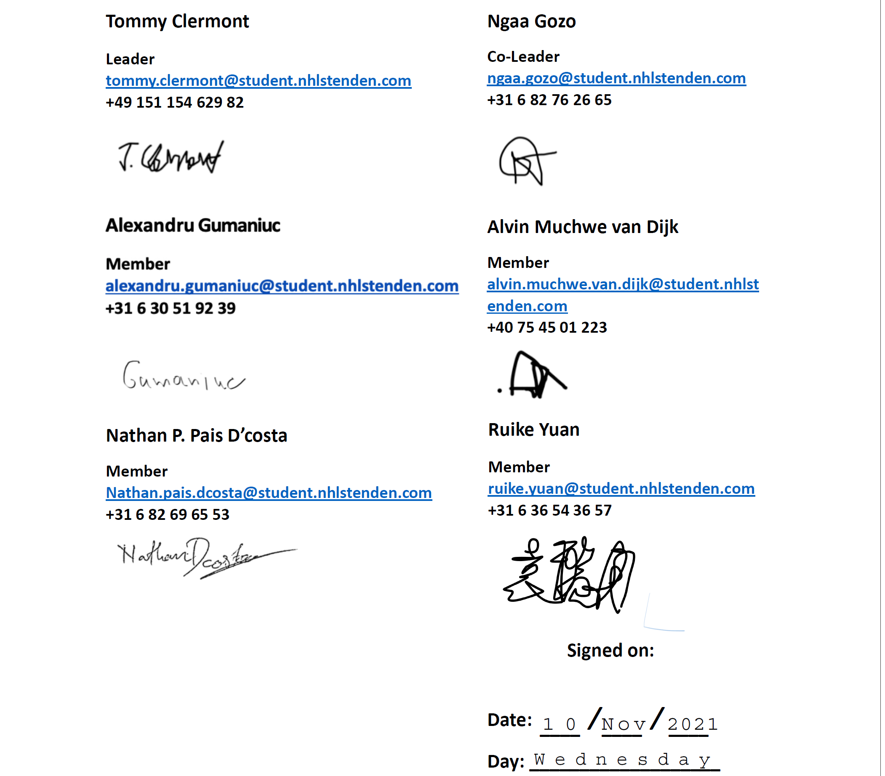

# Code of conduct: IT1B Period 2
This document states what behavior and attendance are expected of all our group
members. This document represents the rules of which we are all to operate under
while working on this project and until it’s finished.

1. All members are to attend planned meetings
2. If a meeting is called for and agreed upon by all, all members must attend.

    - If a member is late, the member must call/message at least one or more of the
      group members, 15-30 minutes before the actually meeting.
    - Members must speak english only during meetings.

3. Remain respectful of opinions and/or feedback received from other group
   members.

    - Hateful comments will not be tolerated.
    - Negative behavior will not be tolerated.

4. Maintain honesty and clear communication in the workplace
5. Remain positive and motivated throughout all meetings and working hours.
6. Being late for meetings with the Client is NOT acceptable. An immediate
   warning will be issued.

    - After three warnings, i.e., fourth offence, the offender will be
      removed from the group.

7. In the event that a group member is sick, he/she must inform the team a soon
   possible.
8. Every member must participate and be available in the online chat (WhatsApp,
   Discord, Microsoft teams) at least once a day, at a reasonable hour.
9. Each group member must be fully committed to completing each task given or
   assigned to him or her.

    - When in need of help, ask other team members, and don’t make excuses.
    - All members must ask for help before the deadline closes.

10. All members must apply to the code conventions while writing code (Commenting
    sections relevant to the developer)
11. All members must be open to receiving feedback from the other team members.
    (Criticism is not allowed, only feedback)
12. If the project deadline is approaching and the project still needs improvements/
adjustments, additional workload from all team members is required (make sacrifices to
meet deadline)

If any of the rules above is broken, a warning might be issued, if half or more of
the team members agree to it.

