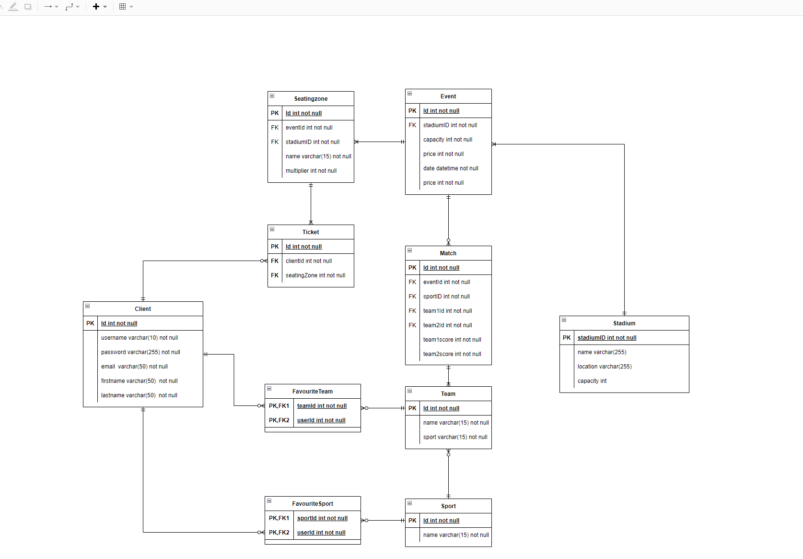
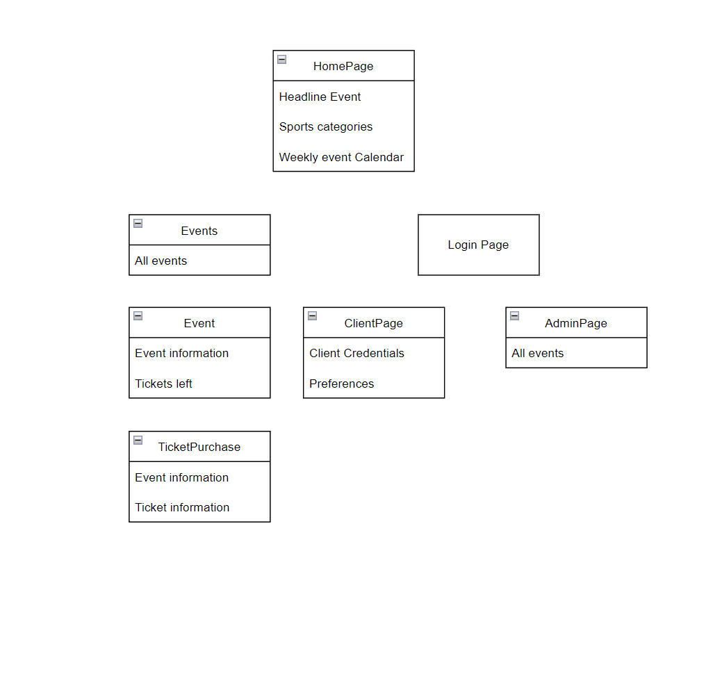

# Introduction

The aim of this document is to give an insight of the application that is to be build. It is an in-depth explanation of all the functionality the web application will offer. 
This project is developed for a legal person (the client) in collaboration with ticket master. The company organizes different sport events at different places and sells tickets to these events. 
An web application is necessary for:

-   keeping track of all events and their details (price, location, type)
-   selling the tickets for this events in an digitally, effective way
-   keeping track of all the people who registered to this events

Our team is made from IT enthusiasts who will develop the web application accordingly to the given standards.

# Information System Description

The application will consist of many pages, each displaying different information.
The two main users of the application are the administrators and the clients. A client can view and select based on his preferences an event he/she wants to attend. The selection is done in an constructive way:

1. The sport type is chose
2. The event from the schedule is selected
3. The user sees detailed information regarding the event and selects a seat
4. Based on the placement of the seat the price might be adjusted
5. The user places the order and receives an confirmation on his email about the ticket he/she purchased

An administrator has the ability to:
-   edit the events (adding, changing details, deleting)
-   add sport types
-   keep track of user registered (total number)

User or admin privileges are determined based on the login detailed provided before a user is granted permission to access the application parts which contain information about the events.
This means that a user will need to login or register before he/she can view the sport events.

All data is stored in a database. Therefore all actions which involve data will involve the database.

# Data model
The new data system keeps all information on users and the events. User login information, such as username, and password and also their favourite teams and sports categories and sports teams. Event information is also stored on the database. This will include information about the; seating arrangements, location, attendance, time, date, teams, matches, and scores.

## User information
Client username, password, and favourite teams, and sports categories are stored. The clients themselves have access to this all their data. all of their information is stored as plain text in the database except for passwords which shall be hashed as a security measure.Since the system is hosting all of the clients information TicketMaster is responsible for all the data and has access to it. However queries used to get client information to be viewed by and end user only retrieve the clientID, e-mail and favourites. Clients have access to ,and are able to alter all their user personal Information. Clients are in charge of their favourite teams and the tickets they buy. 

All of the client information is stored in the; Client, Favourite_team, Favourite_sport, and the Ticket tables.

The Client table 'owns' two other tables, the Favourite_team, and the Favourite_sport tables. The client's credentials is stored on the client table, and the their preferences in their respective tables. A Client entity can have many Favourite_teams, and Favourite_sports. In order for the favourites to exist a client has to make them.

### Client
| Data type|key| Clients        | description | 
| --- |---| --- | --------- |
| INT|PK| clientID| uniquely identifies each client in the database| 
| string|| username       | used for the client only. For a 'personal' touch when viewing the website | 
| varchar(100)| | password       | in a hashed form for security |
| string | | e-mail address | stored so we can easily contact customers if event details change | 

### Favourite_team
|Data type | key | attribute | Description| 
|--- |--- | --- | --- |
| INT | PK | clientID | client identifier |
| INT | PK | teamID | team identifier | 

### Favourite_sport
|Data type | key | attribute | description | 
|--- |--- | --- | --- | 
| INT | PK | ClientID | client identifier |
| INT | PK | sportID | sport identifier | 

### Ticket 
|Data type | key | attribute | | 
|--- |--- | --- | --- | 
| INT | PK | ticketID | sport identifier | 
| INT | FK| clientID | client identifier |
| INT | FK| eventId | event identifier | 
| INT | FK| seatingZone | seating zone identifier | 

## Event Information
Event contain all the information about the each event being held. This is queried by both users and events. It contains relationships to the Stadium, Team , Match and Ticket tables.  The information stored in those tables could've been stored in the Event table, however separating the concerns makes it easier to edit the information, and prevent duplicate data.

Events are hosted in stadiums and have matches. This design choice promotes flexibility since this allows multiple events to be hosted by one stadium, and one event to be able to host many matches.

All the event information in 5 separate tables.
 - Events
 - Stadiums
 - Seating zones
 - Teams
 - Sports

### Event
|Data type | key | attribute |description | 
|--- |--- | --- | --- | 
| INT | PK | eventId | event identifier | 
| DATETIME| | date and time | the date and time of the event |  
| INT| FK | stadiumID | links to the relevant stadium| 
| INT| FK | sport | links to the relevant sport| 

### Match
|Data type | key | attribute |description | 
|--- |--- | --- | --- | 
| INT | PK | matchID | match identifier | 
| INT | FK | eventID | foreign key link to the event | 
| INT | FK | team1 | links to the relevant team| 
| INT | PK | team2 | links to the relevant team| 
| INT | PK | team1score | points scored by the team1| 
| INT | PK | team2score | points scored by the team1 |
| INT | FK | sport_type | links to the sport category of the match | 

### Sport
|Data type | key | attribute |description | 
|--- |--- | --- | --- | 
| VARCHAR(55) | PK | sport_name |the name of the sport| 

### Teams
|Data type | key | attribute |description | 
|--- |--- | --- | --- | 
| INT | PK | teamId |uniquely identifies the team, some teams have the same name but they play in different divisions| 
| VARCHAR(55) | | team_name | the name of the team playing | 
| INT | FK | sport_type | the sport the team is playing | 

### Stadiums
|Data type | key | attribute |description | 
|--- |--- | --- | --- |
| INT | PK | stadiumId |uniquely identifies the stadium | 
| VARCHAR(55) | | stadium_name | no two stadiums can have the same name| 
| VARCHAR(55) |  | stadiumId |physical address of the stadium | 
| INT |  | available_seats | shows the maximum seating capacity of the stadium | 

### Seating zones
|Data type | key | attribute |description | 
|--- |--- | --- | --- |
| INT | PK | seatingZoneID |uniquely identifies the seating area in a stadium | 
| INT |  | price multiplier | this number affects the price of the ticket, the higher the more expensive the ticket | 

## Entity Relationship Diagram

# Output

| Output               | Overview of the events                     |
| -------------------- | ------------------------------------------ |
| Name                 | Events                                     |
| User                 | Web-users                                  |
| Aim                  | To show users the list of events available |
| Frequency            | Always                                     |
| Detailed information | Name of every event / Type of the events     |

| Output               | Schedule                                                        |
| -------------------- | --------------------------------------------------------------- |
| Name                 | Schedule                                                        |
| User                 | Web-users                                                       |
| Aim                  | To allow the stated users to read schedule across the platform. |
| Renew                | When needed                                                     |
| Frequency            | Always                                                          |
| Detailed information | Time, Name of the activity/event                                 |

| Output               | Ticket information                                                        |
| -------------------- | --------------------------------------------------------------- |
| Name                 | Ticket information                                                        |
| User                 | Web-users                                                       |
| Aim                  | Generate the ticket information to inform the customer  |
| Renew                | When needed                                                     |
| Frequency            | Always                                                          |
| Detailed information |  Name of the owner/ID number of the owner/ Gender of the owner/ Phone number of the owner/ Seat number of the owner/ Email address of the owner/ Time, location and name of the sport event  |

| Output | For a single event |
| -------------------- | --------------------------------------------------------------- |
| Name | An Event |
| User | Web-users |
| Aim | To show users the detail of a single event |
| Frequency | Always |
| Detailed information | Name of the event / Type of the event /　The name of the event holder(companies) / Contact number, website link and E-mail address of the event holder / Time, location of the sport event |

| Output | The number of people who signed the event |
| -------------------- | --------------------------------------------------------------- |
| Name | The number of people who signed the event |
| User | Clients/Web-manager |
| Aim | Give the feedback of how popular the activity is and the registration information of every event |
| Renew | Once a person is assigned |
| frequency | Always |
| Detailed information |  Name of the event / The number of people registering the event  |

# Menu structure and authorisation
This following section goes over the websites features, and how a user navigates through the website. The focus is split on meeting the needs of clients, and administrators of the website. Clients view information about events and tickets, while Administrators are able to view and edit all the information.
## Menu Structure
The new system provides four services:
	- prospective clients can browse the website and look at upcoming matches, these will be grouped based on the sport. Authorised clients can view a customizable feed of upcoming events based on their individual choice.
  	- while the clients are browsing the site they can create or login INTo an account from any page.
		- when clients are logged in they can click on their username in the navigation bar and this will take them to a page where they can set change their credentials and set their site preferences
	- admins can get an overview of all past, and upcoming events and edit the the details of each event

based on these needs we have;
- Homepage
- all upcoming events page
- event page
- ticket information page
- login page
- credential management page
- administration page

####

Clients will be only browsing events and purchasing tickets. The only information they have access to is event information, their own credentials, preferences and purchase history. Admins will have access to all the event information as well and are able to edit any information about the events. They do not have access to client information.

### Client use cases
- Login in 
This allows users to open the website and easily view upcoming sports events.

Users start with the home page. This shows the most popular event a the forefront, and just below that other popular events. The nav bar contains sports categories, and when clicked it takes them to a page where only events of that sports type are shown. After clients chose a specific event they're taken to that events page. From here clients can choose to buy a ticket.

##### authenticated client
Clients with an account can go through the exact same flow as non-authorised clients. However when they login they can view their own feed of curated events.

### Administration flow
The main purpose of an administrator is to view information on all events, sports teams, stadiums, and a possibility to edit them. When they login they're taken immediately to the administrative panel, where they can see all of this information.

## Authorization

Any user accessing the website will be able to use it. They are able to see upcoming and past events, however they're unable to subscribe to their favourite sports teams nor their favourite sports types. 

When a user creates an account, they're able to save their favourite sports team or their favourite sport. When they do this they are able to receive email notifications about their favourite upcoming sports events. Users need to create an account with a unique username and password. This makes it easier for the system to uniquely identify each user.

Administrators can login with a single administrator account and password, and can access a separate portal where they can access event information, team, and sport information. Administrators do not have access to user information.

# Organisational Consequences

The code will be tested and reviewed thoroughly with the help of an online platform, which should be easily accessed by the developers of the system (e.g., GitHub).

The UI will be tested at every change that is going to be made by the developers. A few students that are not part of the project will test the quality of the user experience, thus improving features or design by the feedback received from them.

The final test will be conducted by the development team using GitHub and students who were not involved in the project. The feedback from the testing will be used to make final adjustments to the project, if necessary. The final testing will take 2-3 days.

There is no old data to be entered since it will be a new course for the university. Events should be added and modified manually on the website by the admins through an upload form. Future website administrators will be given a manual/ explanation of how to INTeract with the website and upload information/ events.

There should be no conversion problems when handing over the product to the clients. Every software necessary can be accessed by every machine. Databases have to be implemented by developers.

A user manual or oral explanation is available for the event/announcement feature to instruct administrators/certified users on how to create events or announcements on the website and where to retrieve the forms, submitted by users. Another part of this is a training session for end users if requested. 

# Technical consequences
The system will necessitate the usage of a server to host the website. It should be adequate to use a low-end device with at least 4GB of RAM, recommended 8GB of RAM and an entry-level CPU, recommended INTel 3 or higher.

Users must have installed PHP version 7 and up as well as a MYSQL database server.

The server should be accessible through the INTernet or a local area network so that it may be accessed from any location as well as to ensure reliable network connectivity.
An UPS (unINTerrupted power supply) or power generator is also recommended, as it will keep the computer running even if the power goes out, allowing it time to shut down correctly and prevent downtime, data loss or corruption.

An additional server is also recommended on which backup can be stored to ensure sensitive user data retention, as well as to prevent corruption, hacking, and malware attacks.