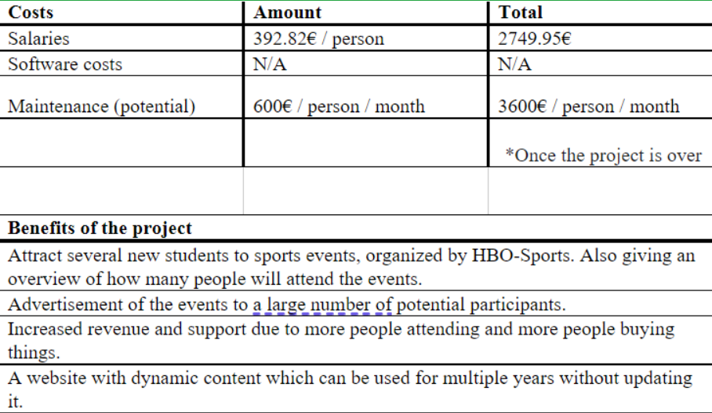

# Introduction

The project team Group B technologies has been approached and appointed by the Dutch branch of TicketMaster, a global leader in ticket distribution and sales, to create a ticketing system for sports events in the Drenthe area of the Netherlands.

Following the documentation process, the group will begin building and programming a website for the ticket system, called NHL Sports which will meet specific specifications.

The stakeholders of this project apart from us: the development team are the clients: Rob Smit and Jan Doornbos, and Ticket Master NL. They will both play a significant role in the development process and will be providing the team with useful resources, information and guidance in order to achieve success in the creation of NHL Sports.

Furthermore, throughout the entire business process, all members of the Group B technologies project team will gain new skills, experiences and knowledge about the field of work, as well as the technical and organizational aspects involved in creating this system.

The prototype will contain a fully functional website with the option to add new features and/or upgrades in the future.

# Project Result

Group B have decided to create a website that works inline with HBO Sports and NHL Stenden. This project aims to document and display sporting events connected to HBO Sport and NHL Stenden (Hogeschool). A requirements analysis (What sports events do you prefer) will be carried out with students and teachers of the IT department of NHL Stenden (for now, subject to change). Listed below is the group’s plan of approach.

Specific - The goal of this project is to build a website that focuses on sporting events connected to HBO Sport and NHL Stenden. Such events might include Football (soccer), Go-Karting, Swimming, Volleyball etc. The website aims to allow users (students and teachers alike) to register for these events with an email sent to their inbox with details of the event (date, time, location, what-to-bring etc.) This will all provide a login page to registered users to view past registrations, recommendations etc.

Measurable - Milestone logs from each of the group members providing visual evidence of where they’ve reached, on what day/date, time etc.

Attainable - This project is challenging and follows the group’s decision, making it a realistically planned project, attainable in the given time frame (8 weeks).

Realistic - This project is realistic interns of the timeframe (8 weeks), in which we need to produce a project plan, primary design, and have multiple meetings with the client to discuss the proposed plans.

Time bound - This project is bound to 8 weeks where the product is to be made available to the client. Following the SCC block plan, this time boundary seems reasonable and is realistic to the project as a whole.

Throughout the entire project, till date, there are several sub-goals formulated, some of which being:

-   Visuals for the site (logo, event pictures etc.)
-   Requirements for the actual website construction
-   Sports genre for the website
-   Sporting events connected to HBO Sport and NHL Stenden.
-   Online registration /login pages
-   Project plan
-   Client meetings

The group and our client have a clear understanding of what the end result of the project will be Sporting page and features an “About NHL Stenden” section.

The project result is that people will be able to easily find out about past and future events that have been organised in and around NHL Stenden. The goal of the project is to inform people about events, so they can register and enjoy these sporting events.

The name decided by the group for this project is "NHL Sports".

# Project activities

Organizational activities

-   Discussing the idea for the new project
-   Meetings within the team
-   Establishing team roles
-   Making a team code of conduct
-   Appointing meetings with the client
-   Reserving rooms for meetings (client/team meetings)
-   Preparation for the interview (coming up with questions)

Documentation

-   Making a portfolio with necessary documents
-   Making a project plan

    -   Splitting the project chapters between team members
    -   Studying and researching individually for each chapter
    -   Submitting the draft version of the project plan
    -   Improving the project plan based on feedback received
    -   Submitting a final version of the project plan

-   Creating a test plan document
    -   Testing the web application
    -   Submitting the document to the client

Development

-   Splitting the tasks within the team
-   Creating a version control environment (github)
-   Building the parts of the web application and merging them
    -   Using HTML/CSS to create the framework of the website
    -   Using PHP to make the website dynamic and responsive
-   Building a database for the application
-   Testing the application
-   Debugging the application against errors/bugs

Team preparation

-   Attending workshops regarding the project
-   Attending 'Introduction to Databases' course
-   Making the assignements from the courses and workshops
-   Reading the course books (individually)
-   Interviewing the clients

Project end

-   Preparing a final presentation of the product
-   Presenting the final product

## Project limits

-   The project will be in development for nine weeks, from the start up to the final touches and delivery, with no aftercare provided, unless agreed with the clients on the set sum in the “Costs and benefits” chapter. The product itself is a ticketing system for sports events by an organization. It will include advertisement for the sports events and the ability to inform the attending about events, times, and locations.
-   The ticketing system itself will include a function that gives people the ability to sign up for sports events and book tickets. Users will be able to find the events, have a closer look at what exactly the event is, sign up for it, book a seat, and several other things that make it easier for users to attend events. The website will consist of a fitting design scheme that words well with sports events and attracts the users. For each event listed on the website, the amount of people who signed up can be tracked and the events can be managed by the organization.

-   The date of starting the project development is 2021-11-08.
-   The final product will be delivered by 2022-01-19.

-   The product will not include any features that were not agreed on with the client, including maintenance.

## Interim results

In this section each of the intermediate results received by the client are listed as follows:

-   Project plan

    -   Document containing an overview of the plan of action, which will detail all the steps involved in the process of creating the project.

-   Functional Design

    -   A document presenting a complete design along with the functionalities for a the new system being developed.

-   Advisory Document: Requirements analysis

    -   Document containing the features the client wants to be included in the final project.
    -   These are arranged in order of priority, making use of the MoSCoW method where:
        -   M = Must have
        -   S = Should have
        -   C = Could have
        -   W = Won’t have

-   Progress meeting reports

    -   Meetings with the clients to discuss and showcase progress made with some of the features.

-   Web design Mock-Ups (2 or 3)

    -   Display of potential designs for the system to be chosen by the clients.

# Quality control

The NHL Sports ticket system will allow users to subscribe and book tickets to see various sporting events, and then see a weekly over-view off all sports events that they subscribed to. In ensuring our web application system meets the requirements and fulfills it’s functionalities by the end of it’s development, we as a project team have defined and set out quality control measures for implementation.

Product quality
The product quality will be established by scheduling weekly client meetings. This, to ensure the develop-ment team is on the correct trajectory and the project team does not deviate too far from the client's desired goal. During these discussions, the clients will be informed of milestones the team has reached, and guid-ance and feedback will be provided, thus setting us in the right direction.

As a collective, we as a team have pledged our commitment to all contribute to the a working product by communicating our progress frequently on the platforms we have allocated for project realization, namely GitHub and Discord. This will make it easier to track and change any aspects to the development process that could potentially hinder the quality of the end result.

Functional requirements will be tested with integration testing and system testing. As the application feature-set grows during development each feature will be tested to see if it meets the requirement specification. While we test the functionality of the feature-set. We will test the performance and usability of each feature.

Code quality
The quality of the code, is defined by the following:
• The code being easy to understand.
• The code fulfilling its intended purpose.
• It being well-documented and easy to read.
We will make sure these standards are met and constantly monitored by abiding to a variety of code conventions such as:
• Utilizing the W3 validator to verify HTML and CSS syntactical correctness.
• Adhering to the PHP Standard Recommendation (PSR-12), -an extended coding style- to ensure there is consistency and clarity in the way in which the code is written.
• Cross checking code amongst team members
• Commenting our code.
All code must meet the style guidelines unless a valid reason is given.

Lastly, there will also be efforts made to reach out to both experienced programmers, as well as people who regularly attend events in which ticket bookings and reservations are required, to look at and examine our final product and thereafter offer actionable feedback before the submission date.

## Product quality

NHL Sports provides a way for users to easily follow upcoming sports events, and Ticketmaster employees to easily update sports and event data.

Quality of the product will be insured by our testing strategy which tests the functional and non-functional requirements.

functional requirements will be tested with integration testing and system testing. As the application feature-set grows during development each feature will be tested to see if it meets the requirement specification. While we test the functionality of the feature-set. We will test the performance and usability of each feature.

## Code quality

Before development the a PHP code style guide will be developed which is an extension of the [PSR-12](https://www.php-fig.org/psr/psr-12/) style guide. All code must meet the style guide unless a valid reason is given. THe HTML must also comply with the [w3 validator](https://validator.w3.org/) to ensure a good user experience.

# Project organization

Project name:NHL Sports ticket system

## Organization personnel

**Group B Technologies**
The team members, during the period that the project is going on, are expected to avail themselves to work on the project according to the stated time.

### Team members of the organization

| Name                  | Role               | E-mail                                       |
| --------------------- | ------------------ | -------------------------------------------- |
| Tommy Clermont        | Leader             | tommy.clermont@student.nhlstenden.com        |
| Ngaa Gozo             | Co-leader          | ngaa.gozo@student.nhlstenden.com             |
| Alexandru Gumaniuc    | Quality controller | alexandru.gumaniuc@student.nhlstenden.com    |
| Ruike Yuan            | Secretary          | ruike.yuan@student.nhlstenden.com            |
| Alvin Muchwe Van Dijk | Quality controller | alvin.muchwe.van.dijk@student.nhlstenden.com |
| Nathan P. Pais Dcosta | Quality controller | nathan.pais.dcosta@student.nhlstenden.com    |

---

> Competency
>
> > The team consists of various kinds of professionals. For example, Tommy Clermont, Alexandru Gumaniuc and Ngaa Gozo are experienced
> > programmers familiar with Javascript, sql, python, php and html. Other members like Nathan P. Pais Dcosta, Alvin Muchwe Van Dijk
> > and Alvin Muchwe Van Dijk are fully capable of organizing different kinds of tasks and put ideas into actions. More than one teammember can perform serveral roles and get the work done well.

### Project Clients

**A Dutch branch of Ticket Master**

| Name         | E-mail                      |
| ------------ | --------------------------- |
| Rob Smit     | Rob.smit@nhlstenden.com     |
| Jan Doornbos | jan.doornbos@nhlstenden.com |

### Stake holders

-   Company(A Dutch branch of Ticket Master)
-   Rob Smit
-   Jan Doornbos
-   Development team(Group B Technologies)
-   Stadiums

## Communication within the organization

The team will one interview with the client to establish their requirements, reach an agreement and to lay down some ground rules for meetings such as how often they would like to meet and in which the client would be updated at milestones. During a meeting, any member can ask for assistance on parts they do not understand completely.

There will be a meeting at least once a week. The meeting frequency depends on the work progress of the team. This is for both parties to see how much progress has been made over the course of the previous week (Weekly report).

Using the weekly quota, the team can plan and adjust the needs of the project going forward. Furthermore, the team decided to use WhatsApp, Discord（social software) and Outlook which includes the emails of team members, also as the best way to communicate with the members. The team has a shared repository on github.com where all the required documents can be edited by every team member simultanously.

Finally, the team consider to use Trello or Monday as an additional digital tool for collaborating within the project group, which will enable a smooth working environment for the team members. Those platforms will be able to show the working progress of the members during the project as an invitaion link can be generated for the clients to check and measure the progress.

## Availability

Both the client’s and the team’s schedule change on a weekly basis, which should be considered when planning meetings, so that each stakeholder is available to attend.
The schedule of the client is available online, as well as the team members’ schedule.

### Possible time to meet the client:

| Client       | Avaliability                       | Way of contact |
| ------------ | ---------------------------------- | -------------- |
| Rob Smit     | Tuesday, Thursday(depends), Friday | Via email      |
| Jan Doornbos | Flexible                           | Via email      |

# Planning and scheduling

<pre>Task:                                              Week:</pre>

| <b>Preparation</b>                                 | <b>1</b>  | <b>2</b>  | <b>3</b>  | <b>4</b>  | <b>5</b>  | <b>6</b>  | <b>7</b>   | <b>8</b>   | <b>9</b>  | <b>Total</b> |
| -------------------------------------------------- | --------- | --------- | --------- | --------- | --------- | --------- | ---------- | ---------- | --------- | ------------ |
| Attending lectures                                 | 3         | 3         | 3         | 3         | 3         | 3         | 1          | 2          | 1         | 22           |
| Attending workshops                                | 3         | 3         | 3         | 3         | 1         | 2         | 1          |            |           | 16           |
| Setting up a version control environment (github)  | 1         |           |           |           |           |           |            |            |           | 1            |
| Client meetings                                    | 1         | 1         | 1         | 1         | 1         | 1         |            |            |           | 6            |
| Team meetings                                      | 5         | 5         | 5         | 5         | 5         | 5         | 5          | 5          | 5         | 45           |
| Establishing team roles                            | 2         | 1         |           |           |           |           |            |            |           | 3            |
| Preparation for interviews with the client         | 1         | 1         | 1         | 1         | 1         | 1         |            |            |           | 6            |
| Researching information                            | 3         | 3         | 3         | 2         | 2         | 2         | 2          | 1          | 1         | 19           |
| Splitting tasks between team members               | 1         | 1         | 1         | 1         | 1         | 1         |            |            |           | 6            |
| Discussing and researching the idea of the project | 3         | 1         |           |           |           |           |            |            |           | 4            |
| <b>Execution</b>                                   |           |           |           |           |           |           |            |            |           |              |
| Creating a Project Plan                            | 5         | 5         |           |           |           |           |            |            |           | 10           |
| Creating a Team Code of Conduct                    | 3         |           |           |           |           |           |            |            |           | 3            |
| Creating a Requirements Analysis document          |           |           | 5         |           |           |           |            |            |           | 5            |
| Creating an Advise Report document                 |           |           | 5         |           |           |           |            |            |           | 5            |
| Creating a mock-up desing of the application       |           | 5         | 5         | 5         |           |           |            |            |           | 15           |
| Creating the Entity Relationship Diagram (ERD)     |           |           | 2         |           |           |           |            |            |           | 2            |
| Creating the Data Flow Diagram (DFD)               |           |           | 2         |           |           |           |            |            |           | 2            |
| Creating a Functional Design document              |           |           | 5         |           |           |           |            |            |           | 10           |
| Coding HTML/CSS                                    |           |           |           |           | 10        | 10        | 10         |            |           | 30           |
| Coding PHP                                         |           |           |           |           | 10        | 15        | 15         | 15         | 15        | 70           |
| Creating a Database                                |           |           |           |           | 10        | 10        |            |            |           | 20           |
| Filling in the Database                            |           |           |           |           | 10        | 20        | 15         | 15         |           | 60           |
| Linking all the coded parts toghether              |           |           |           |           |           |           | 20         | 20         | 20        | 60           |
| Improving documents based on feedback              |           | 5         | 5         | 5         |           |           |            |            |           | 15           |
| <b>Finalization</b>                                |           |           |           |           |           |           |            |            |           |              |
| Testing and debugging the application              |           |           |           |           |           |           | 20         | 20         | 20        | 60           |
| Improving the application (coding)                 |           |           |           |           |           | 10        | 15         | 20         | 15        | 60           |
| Adding final adjustments                           |           |           |           |           |           |           |            | 10         | 10        | 20           |
| Preapearing the portfolio with all the documents   |           |           |           |           |           |           |            |            | 5         | 5            |
| Making a final presentation of the project         |           |           |           |           |           |           |            |            | 5         | 5            |
| Presenting the final product                       |           |           |           |           |           |           |            |            | 1         | 1            |
| <b>Total</b>                                       | <b>31</b> | <b>34</b> | <b>46</b> | <b>31</b> | <b>54</b> | <b>80</b> | <b>104</b> | <b>108</b> | <b>98</b> | <b>586</b>   |

# Costs and benefits

-   The budget of the entire project is an estimate as there was no clear budget given by the clients. As developers we estimate the project to use a budget of about 5,000-15,000 euros. This number comes from research about other Ticket Systems that have been developed in the past.

-   Srivastava, Sudeep. “How Much Does It Cost to Develop an Event Ticket Booking App?” Appinventiv, 16 July 2020, https://appinventiv.com/blog/event-management-and-ticket-booking-app-development-cost/. 

-   Walter, Troy. “How Much Cost Is Required to Develop an Event Ticket Booking App like Stubhub.” Medium, Medium, 30 Aug. 2019, https://troy-walter.medium.com/how-much-cost-is-required-to-develop-an-event-ticket-booking-app-like-stubhub-b50a8eafc186. 

-   Jitu Bhaskar Jitu Bhaskar is the founder of SemiDot Infotech, et al. “Event Ticket Booking App Development: Cost &amp; Features.” Semidot Infotech, 16 Sept. 2021, https://semidotinfotech.com/blog/event-ticket-booking-app-development-cost/#:~:text=Considering%20all%20these%20factors%2C%20the,to%20%2440%2C000%20including%20core%20features. 

# Risk analysis

The following chapter will cover the potential internal and external risks associated with establishing this project plan and product. Along with the risk descriptions, a further examination of their impacts, severity, and likelihood of occurrence will be presented, as well as feasible solutions to these problems and how best to effectively and efficiently execute them.
